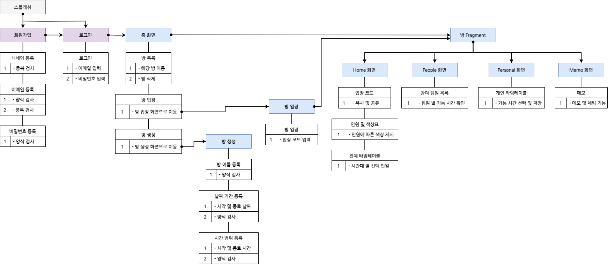

# 모바일 앱 프로그래밍 프로젝트 TimeToMeet

> 2024-1학기에 진행한 모바일 앱 프로그래밍 프로젝트입니다.

|[양승환](https://github.com/ysh020702)|[백영엽](https://github.com/yeoby97)|[윤해진](https://github.com/Yunhaejin)|[서지혜](https://github.com/swisdom784)|[박도형](https://github.com/polytopark)|
|:---:|:---:|:---:|:---:|:---:|
||||||

## 개발 목적
이 프로젝트는 단체 모임 일정을 쉽고 편리하게 정하는 것을 목표로 합니다.  
우리는 누군가와의 만남과 협업을 위해 항상 시간 약속을 합니다. 한 명과의 약속은 간단한 대화로 쉽게 시간을 정할 수 있겠지만, 5명, 10명, 20명.. 인원이 늘어남에 따라 최대 다수가 참여 가능한 시간을 정하기에 어려움이 따릅니다.   
단체 채팅 앱에서 일일이 메시지를 주고받으며 가능한 시간을 조율하는 것은 비효율적이고 번거롭습니다. 그리고 단체 채팅 앱에서 투표를 통해 일정을 결정하는 방식으로는 수많은 시간대를 투표에 넣을 수 없으며. 구성원의 선택을 시각적으로 명확하게 확인하기 어렵습니다. 이러한 번거로움과 불편함은 결국 비효율적 시간 낭비로 이어집니다.   
우리가 모임 일정을 정하기 위해 어느 정도의 시간을 사용하고 있을까요?  
CareerBuilder의 조사에 따르면, 직원들이 회의 일정을 조율하는데 연간 약 60시간을 사용한다고 합니다. 일상적인 만남까지 포함한다면 우리는 엄청난 시간을 약속을 잡는 데에 사용하고 있다는 것을 알 수 있습니다.   
따라서 이러한 문제점들을 해결하기 위해 모두에게 내가 가능한 시간을 한눈에 보여주고, 구성원들의 가능 시간을 시각적으로 표현할 수 있는 앱을 구상하게 되었습니다.  

## 프로젝트 설명
TimeToMeet 프로젝트에서는 단체 일정을 정할 때의 불편함을 시각적인 시간표를 통하여 해결하려 하였습니다.   
방장이 약속을 잡을 날짜와 시간대의 범위를 선택해 이를 토대로 시간표가 생성되도록 하였습니다. 이 범위 내에서 구성원들은 본인이 희망하는 시간대를 개인 시간표에서 고를 수 있습니다. 구성원들이 선택한 시간대를 한눈에 보기 위해 전체 시간표를 만들었습니다.   
전체 시간표에서는 특정 시간대에 가능한 구성원의 수가 많을수록 색이 진하게 표현되게 구현해, 최대 다수가 참여할 수 있는 시간대를 직관적으로 알아볼 수 있도록 하였습니다. 그리고 시간대별로 누가 선택하였는지 알 수 있어 가능한 인원을 기존 방식보다 쉽게 알 수 있습니다. 부가적으로, 자체 채팅 기능을 이용하여 필요할 때 소통도 편리하게 할 수 있습니다. 

## 앱 구조도
 

## 데이터 구조도
 

- 유저 정보 구조
  1. UserAccount 클래스를 DB에 저장해서 사용한다.  
    -> FirebaseAuth.createUserWithEmailAndPassword() 를 사용해 user정보를 생성한다. 
    - IdToken (firebase user ID)
    - EmailId
    - Password
    - UserName (닉네임)  

  2. DB 에 child "UserAccount", "userNickname" 를 총 두 개 만들어 유저 정보를 저장한다.  
    -> 닉네임 중복 검사 및 이메일 중복 검사를 효율적으로 시행하기 위해 userNickname child 를 따로 생성한다.  

- 방 구조  

  room 클래스를 DB에 저장해서 사용한다. 

  1. String
    - name (이름)
    - owner (생성인)
    - password (입장 비밀번호)   

  2. HashMap
  
    - guset (입장 유저) : 'username', 'weight'  
      - weight 는 sum 과 같이 칸별로 아이디를 만들어 아이디별로
      이 유저가 선택했으면 1, 선택하지 않았으면 0을 저장하는 리스트
    - day (시작 및 끝 날짜) : 'startday', 'endday' 의 키 값으로 저장 
    - time (시작 및 끝 시간) : 'starthour', 'endhour' 의 키 값으로 저장
    - fixedMemo (상단 고정 메모) : 'message, 'writer' 의 키 값으로 저장   

  3. List
    - sum : 각 날짜의 시간을 나타내는 칸별로 아이디를 만들어 아이디에 해당하는 sum 리스트의 값에 선택한 사람 수를 저장
    - messageList : 'comment', 'writer' 을 엮은 hashmap 의 리스트(hashmap<string,string>)

## 주요 기능
- 로그인 
앱을 시작하면 로그인을 하도록 했습니다. 
이는 현재 사용자가 누구인지 어플이 인식하도록 하기 위함입니다.  
회원가입을 위한 페이지를 제공해 언제든지 새로운 아이디를 만들 수 있습니다. 
본인이 원하는 닉네임을 사용할 수 있어 즐거움을 더해줍니다. 
로그인을 성공하면 홈화면에 입장합니다.  

- 홈 화면
  방 목록과 두 개의 버튼(방 만들기, 방 입장하기)가 있습니다.   
  우선 방 목록에는 현재 내가 이용할 수 있는 방 목록이 제시됩니다.  
  이는 방에 입장할 때마다 입장 코드를 입력하는 불편함을 줄이기 위함입니다.  
  또한 방 삭제 기능을 통해 종료된 일정 또한 관리가 가능합니다.  
  한번 입장코드를 통해 입장하게 되면 이후에는 홈 화면의 방 목록을 통해 입장할 수 있습니다.   
  
- 방 만들기 
  우선 방 이름을 설정합니다. 
  그 이후 날짜범위(시작날짜, 종료날짜)와 시간범위(시작시간, 종료시간)을 정합니다.  
  확인버튼을 누르면 방이 생성되며, 홈 화면으로 이동합니다.  

- 방 입장하기 
  입장 코드를 입력하는 부분과 입장버튼이 있습니다.  
  입장 코드는 이미 방에 들어가 있는 방장 또는 구성원으로부터만 전달받을 수 있습니다. 
  입력한 입장 코드와 대응되는 방이 존재하면 해당 방으로 입장하게 됩니다.  
  앞에서 설명했듯이, 해당 방은 이제 해당 사용자의 홈 화면에 노출됩니다.   

- 방 
  - Home (전체 선택 시간) 
    참여한 인원들의 선택을 모아 총 결과를 보여줍니다.  
    색의 진하기를 이용해 시간대별 인원수를 알 수 있도록 했습니다. 
    또한 특정 시간대를 클릭하면 그 시간대에 투표한 모든 사람을 확인할 수도 있습니다.  

  - People (구성원 선택 시간) 
    해당 페이지에서는 구성원 리스트를 볼 수 있습니다. 
    특정 구성원을 선택하면 해당 구성원이 어떤 가능 시간표를 가지는지를 볼 수 있습니다.   

  - Person (개인 선택 시간) 
    개인이 희망하는 시간들을 선택할 수 있습니다.   
    확인버튼을 눌러 저장을 할 수 있습니다.   

  - Memo (팀 메모)  
    메모와 메모를 남긴 사람을 볼 수 있는 페이지입니다. 
    메모는 실시간으로 상호간에 볼 수 있으며, 메모 기능을 통해 필요한 내용을 전달하거나, 일정을 조율할 수 있습니다.   

## 디자인
|||||
|:---:|:---:|:---:|:---:|
|스플래쉬|로그인|회원가입|홈 화면|

||||
|:---:|:---:|:---:|
|방 생성하기|생성 확인|방 입장하기|

|||||
|:---:|:---:|:---:|:---:|
|방 - Home|방 - People|방 - Person|방 - Memo|

  

## 시연 영상

  
